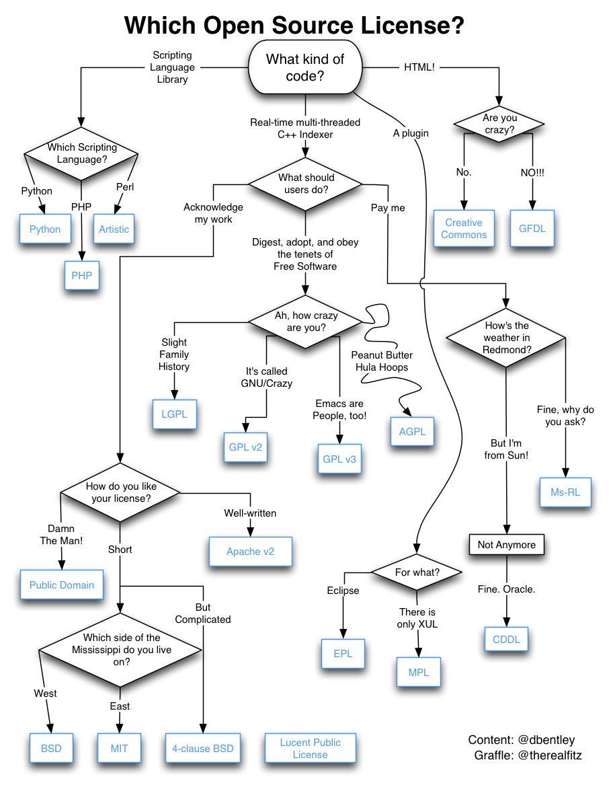

# 坑

## Windows

### RDP


查看 RDP 端口

```
Get-ItemProperty -Path 'HKLM:\SYSTEM\CurrentControlSet\Control\Terminal Server\WinStations\RDP-Tcp' -name "PortNumber"
```



更换 RDP 端口为 `XXXX`

```
Set-ItemProperty -Path 'HKLM:\SYSTEM\CurrentControlSet\Control\Terminal Server\WinStations\RDP-Tcp' -name "PortNumber" -Value XXXX
New-NetFirewallRule -DisplayName 'RDPPORTLatest' -Profile 'Public' -Direction Inbound -Action Allow -Protocol TCP -LocalPort XXXX
```



RDP 服务器需要至少 **使用账号密码**_**（非 PIN 码）**_**完成一次系统登陆 **后才可用。



### WSL


> 参考的对象类型不支持尝试的操作。
>
> \[已退出进程，代码为 4294967295]

```
netsh winsock reset
```



## Linux

### Shell


Here Document (`<<`) 想要过滤去掉行首的 Tab (`\t`) ：**`<<-`**



Here Document (`<<`) 输入的文本默认还是会被 **扩展**，如果需要禁用，需要对起始的 limit\_string 做处理（假设 limit\_string 为 `_EOF`）：

* 用 `\` 转义：`\_EOF`
* 用双引号包裹：`"\_EOF"`
* 用单引号包裹：`'\_EOF'`


### Config


systemd-networkd 的 [默认配置](https://man.archlinux.org/man/systemd.network.5) 会禁用 **内核 IP 转发 **，若想要开启，除了调整内核参数外，还需要在对应的 `.network` 配置文件的 `[Network]` 一节设置 `IPForward=yes `。



配置文件最好以换行符结尾，方便后续 `echo "key=value">>config.conf` 追加配置操作。


## GitHub

### LICENSE



## Network


市面上常见的路由器内置的 **端口转发** 功能一般只对 `IPv4 `生效，**对于 `IPv6 `无效**。


## Hardware

### RJ45 水晶头


### 螺丝标准

.png>)
