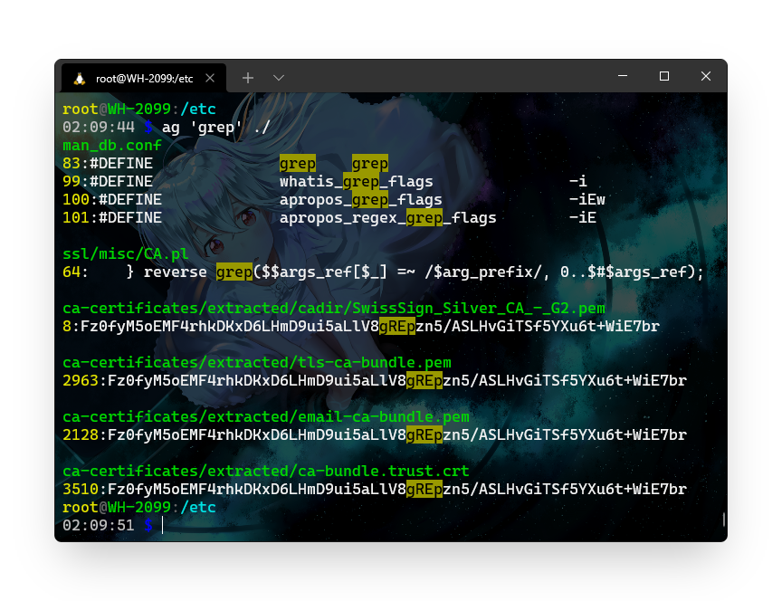

# 新时代 Linux 命令

### [bat](https://github.com/sharkdp/bat)


#### 功能

在 `cat` 基础上增加了 **语法高亮**。

#### 安装命令

```bash
pacman -S bat
```

### [progress](https://github.com/Xfennec/progress)


#### 功能

查找当前在您的系统上运行的 coreutils 基本命令（cp、mv、dd、tar、gzip/gunzip、cat 等）并显示复制数据的 **百分比、估计的时间 和 吞吐量**。

#### 安装命令

```bash
pacman -S progress 
```

### [icdiff](https://github.com/Xfennec/progress)

.png>)

#### 功能

在传统 `diff` 的基础上扩展了 **左右** **色彩** 对比。

#### 安装命令

```bash
pip install git+https://github.com/jeffkaufman/icdiff.git
```

### [ag](https://github.com/ggreer/the\_silver\_searcher)



#### 功能

闪电搜索，`ack` 的直接后代，也可以替代 `grep` 。

#### 安装命令

```bash
pacman -S the_silver_searcher
```

### [glances](https://github.com/nicolargo/glances)


**功能**

替代 `htop`，**跨平台**的系统状态监控（支持 **Web**）。

#### 安装命令

```bash
pacman -S glances
```

### [tig](https://jonas.github.io/tig/)


####

#### 功能

基于 `ncures` 的 **git 浏览器**。

#### 安装命令

```bash
pacman -S tig
```

### [fzf](https://github.com/junegunn/fzf)


#### 功能

通用的命令行 **模糊查找** 器。

#### 安装命令

```bash
pacman -S fzf
```

### [cloc](https://github.com/AlDanial/cloc)


#### 功能

计算 **代码行数** 。

#### 安装命令

```bash
pacman -S cloc
```

### [ncdu](https://dev.yorhel.nl/ncdu)


#### 功能

基于 `ncurses`磁盘使用分析器，替代 `du` 。

#### 安装命令

```bash
pacman -S ncdu
```
