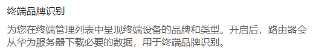

# MAC 地址厂商信息

## 引言

在手头用的无线路由器的后台，有这么一个设置：

这个倒也好理解，应该就是会从服务器下载 MAC 地址对应的厂商数据库。然后就可以根据 MAC 地址对设备的品牌进行识别，并在显示时加上对应的 LOGO，方便用户直观地分辨联网设备。

最近在处理校园网络答疑解惑的工作时，发现无线网络认证的日志中，与联网设备相关的只有一个干干的 MAC 地址，实在是不便于区分具体的设备（总不能指望用户给你报 MAC 地址吧）。联想到路由器上的这个功能，打算扩展一下日志内容，利用 MAC 地址对设备厂商进行标注。

**搜集资料过程中发现** [**IEEE 官网**](https://standards.ieee.org) 的**官方资料与互联网上的内容出入较大，故做以记录。**

## 常见资料的问题

> MAC 地址共 48 位（6 个字节），以十六进制表示。第 1 Bit 为广播地址（0）/群播地址（1），第 2 Bit 为广域地址（0）/区域地址（1）。前 3-24 位由 IEEE 决定如何分配给每一家制造商，且不重复，后 24 位由实际生产该网络设备的厂商自行指定且不重复。

**以上这种说法其实有点管中窥豹的感觉，并不全面。**

IEEE 分配给制造商的其实是 OUI，其长度除了最常见的 24 位，还可能是 28 位或者 36 位。而 48 位 MAC 地址，属于 IEEE 标准中的 EUI，是由 OUI 扩展而来的。也就是说为了识别制造商，需要匹配的位数可能不止 24 位。


这一点其实本质上与 [无类别域间路由](https://zh.wikipedia.org/wiki/%E6%97%A0%E7%B1%BB%E5%88%AB%E5%9F%9F%E9%97%B4%E8%B7%AF%E7%94%B1) Classless Inter-Domain Routing 非常接近，都是对地址的分层进行细化，以提高利用率。


## 官方资料

### 标识符概念的解释


Guidelines for Use of Extended Unique Identifier (EUI), Organizationally Unique Identifier (OUI), and Company ID (CID)


### 查询标识符的页面



### 标识符数据文件

1. MAC Address Block Large (**MA-L**) [TXT](http://standards-oui.ieee.org/oui/oui.txt) [CSV](http://standards-oui.ieee.org/oui/oui.csv)
2. MAC Address Block Medium (**MA-M**) [TXT](http://standards-oui.ieee.org/oui28/mam.txt) [CSV](http://standards-oui.ieee.org/oui28/mam.csv)
3. MAC Address Block Small (**MA-S**) [TXT](http://standards-oui.ieee.org/oui36/oui36.txt) [CSV](http://standards-oui.ieee.org/oui36/oui36.csv)

## 重点内容

### 术语缩写

* **CUI**: Company ID 公司标识符
* **OUI**: Organizationally Unique Identifier 组织唯一标识符
* **EUI**: Extended Unique Identifiers 扩展统一标识符
* **MAC**: Media Access Control (Address) 媒体访问控制（地址）
* **RA**: Registration Authority 注册机构


`XXX-N` 代表长度为 N 个二进制位的 XXX 类型的标识符。


### 对应关系

|    标识符 | 常见用途                 |
| -----: | -------------------- |
| EUI-48 | MAC-48（通常所说的 MAC 地址） |
| EUI-64 | MAC-64（仍未广泛应用）       |

> EUI-48 和 EUI-64 标识符最普遍的用法是作为全球唯一的网络地址（有时称为 MAC 地址），如各种标准中规定的那样。例如，根据 IEEE 标准 802，EUI-48 通常被用作硬件接口的地址，历史上使用 "MAC-48"的名称。另一个例子是，根据 IEEE 标准 1588，EUI-64 可作为一个时钟的标识符。IEEE 标准 802 还规定了 EUI-64 用于 64 位全球唯一的网络地址。
>
> > EUI-48 and EUI-64 identifiers are most commonly used as globally unique network addresses (sometimes called MAC addresses), as specified in various standards. For example, an EUI- 48 is commonly used as the address of a hardware interface according to IEEE Std 802, historically using the name “MAC-48”. As another example, an EUI- 64 may serve as the identifier of a clock, per IEEE Std 1588. IEEE Std 802 also specifies EUI-64 use for 64-bit globally unique network addresses.

### MAC 地址注册类型

* **MA-L**: MAC-Large 大块的 MAC 地址
* **MA-M**: MAC-Middle 中块的 MAC 地址
* **MA-S**: MAC-Small 小块的 MAC 地址

.png>)

### EUI-48 的结构

.png>)

## 如何根据 EUI-48 匹配 OUI

> 如果前 24 位与分配给 IEEE RA 的 OUI 相匹配，那么对前 28 位或 36 位的搜索可能会显示出 MA-M 或 MA-S 的分配。\
> 如果在 MA-S 搜索中没有发现 OUI-36，那么对前 24 位或 28 位的搜索可能会发现一个 MA-L 或 MA-M 分配，OUI-36 是由分配块的一个成员创建的。
>
> > If the first 24 bits match an OUI assigned to the IEEE RA, then a search of the first 28 or 36 bits may reveal an MA-M or MA-S assignment. If the OUI-36 is not found in an MA-S search, then a search of the first 24 or 28 bits may reveal an MA-L or MA-M assignment from which the OUI-36 has been created from a member of the assigned block.


最终的查询结果也不总是完全准确的哦！

> 请您注意，所列的公司和编号在产品实施中可能并不总是很明显。一些制造商将部件制造分包出去，另一些制造商在其产品中包括注册公司的所有 MAC（MA-L、MA-M、MA-S）。
>
> > Your attention is called to the fact that the firms and numbers listed may not always be obvious in product implementation. Some manufacturers subcontract component manufacture and others include registered firms' All MAC (MA-L, MA-M, MA-S) in their products.


具体的步骤如下：

1. 取 MAC 地址前 **24** 位（对应到常用的杠分十六进制表示就是前三组的 6 个 十六进制字符，如 AA-BB-CC-DD-EE-FF 的 AABBCC）\
   与数据库的 `assignment` 字段进行精确匹配。
2. 若匹配结果的 `organization_name` 字段为 `IEEE Registration Authority` ，则继续进行下一步；\
   否则直接返回当前匹配结果。
3. 取 MAC 地址前 **28** 位（对应到常用的杠分十六进制表示就是前三组的 7 个 十六进制字符，如 AA-BB-CC-DD-EE-FF 的 AABBCCD）\
   与数据库的 `assignment` 字段进行精确匹配。
4. 若匹配结果的 `organization_name` 字段为 `IEEE Registration Authority` ，则继续进行下一步；否则直接返回当前匹配结果。
5. 取 MAC 地址前 **36** 位（对应到常用的杠分十六进制表示就是前三组的 7 个 十六进制字符，如 AA-BB-CC-DD-EE-FF 的 AABBCCD）\
   与数据库的 `assignment` 字段进行精确匹配。
6. 若有结果直接返回，无结果返回空。
