# MRO 三定律

## 0. 声明


**不从 `0` 开始难不成从 `1` 开始？你知道吗，世上只有 `10` 种人，程序员和非程序员;**


* **Keep it simple, stupid !**
* 仅代表个人观点，难免有缺漏之处，欢迎指正
* 本文假设您已经对 Python 中面向对象的基础内容有所掌握
* 本文有明确的主题，故默认顶层基类为 `object`（不涉及 `type` 有关内容）

## 1. 关于 MRO

### 1.0 什么是 MRO ？


**方法解析顺序（Method Resolution Order, MRO）** 是在 **面向对象编程** 中，当某个实例对象应用了继承，进而引发 **多态** 特性时，编译/解释器 **查找并决定具体实例方法的顺序** 。


根据子类继承的父类数量区分，MRO 会有两种情况：

1. 单继承中的 MRO —— 这种情况比较简单。
2. 多继承中的 MRO —— 这种情况相对复杂，并且随着类继承层次的混乱，复杂程度往往超乎想象。

一般情况下所提到的 MRO 基本都是指复杂多继承中的 MRO ，其本质是 **一个顺序**，**可用具体编程语言中的序列来表示（Python 中就是 `collections.abc.Sequence`）**，本文同一般情况。

### 1.1 MRO 有什么用？

* 实现方法重载
* 构建 OOP 多态
* 保证继承有效

**简而言之，MRO 是 OOP（面向对象编程）的一根顶梁柱，没了它，OOP 的特性和优势都会大打折扣。**

关于 MRO 的作用，可以回顾一下 **OOP** 中关于 ** **_**重载、继承、多态**_ 的内容。

## 2. 关于 C3-MRO 算法

### 2.0 什么是 C3-MRO 算法？


**C3 superclass linearization（C3 超类线性化算法），其本质是一个排序算法**，主要用于生成多继承 MRO（方法解析顺序）。


> 1996 年的 OOPSLA 会议上，论文 [_"A Monotonic Superclass Linearization for Dylan"_](https://doi.org/10.1145/236337.236343) 首次提出了 C3 超类线性化算法。随后被应用于 Python 2.3 中新式类的 MRO 解析。

为了便于叙述，本文中称之为 **C3-MRO 算法**（连字符分隔的后缀表示其实际应用领域）。

### 2.1 C3-MRO 算法与 Python 有什么关系？

Python 2.2 版本向 2.3 版本过度时，为了贯彻 OOP 的语言层级设计，在已有的`经典类`基础上新增了`新式类`。


Python 3 中摒弃了经典类，仅留新式类，可以说 **新式类就是 Python 3 中默认使用的类** 。


关于两个类型的具体内容在此不做深究，但新式类有一个重要特性就是在未显式声明继承父类的情况下默认继承自`object`类，配合 Python 允许多继承的语法设计，初期为开发者们带来了不小的问题。勾出了不少隐居大佬掏出了珍藏的各种~~黑魔法~~现身江湖，但很不幸都没能获得足够的成效：

> [PEP 253The Python 2.3 Method Resolution Order](https://www.python.org/dev/peps/pep-0253/) [\[Python-Dev\] perplexed by mro](https://mail.python.org/pipermail/python-dev/2002-October/029035.html)

最终开发者们发现，其实早有学者研究出了合适的解决方案：1992 年苹果推出了 Dylan 语言，1996 年相关的论文提出了 C3 算法。于是 C3 算法在 2003 年临危受命，揽下了解决 Python 2.3 版本中`新式类`MRO 的烂摊子，**时至 2021年的 Python 3.9.6 版本，仍是 Python 中解决多继承 MRO 问题的核心算法**。


_还真没听说过这 Dylan 语言 XD_


事实上，在 Python 中，你可以利用 `cls.__mro__` 或者 `cls.mro()` 获取类或对象的 MRO 序列（二者的区别在于返回的分别是元组 `tuple` 和 列表`list`），而它就是基于 C3-MRO 算法的：

```python
class A(object):
    pass
class B(A):
    pass

print(B.__mro__)
# (<class '__main__.B'>, <class '__main__.A'>, <class 'object'>)
print(b.mro())
# [<class '__main__.B'>, <class '__main__.A'>, <class 'object'>]

# 二者的区别在于返回的分别是 tuple 和 list
```

## 3. C3-MRO 算法思路剖析


以下内容建立在作者的理解上，**带有浓重个人色彩，难免缺乏客观度** 。

但个人认为这样思路**相对自然**，希望能给您一点启发！


### 3.0 C3-MRO 算法的具体内容

我们先把思想放一放，看看 C3-MRO 算法的具体内容。

> **首先为了方便讨论，我们约定一些符号：**
>
> * 有顺序的元素集合称为 **序列** ，记作$$[\quad]$$
> * 类 C 的 MRO 亦称为 **C 的线性化**，记作 $$L(C) = [C_1,C_2,\cdots,C_N]$$
> * 在 $$L(C) = [C_1,C_2,\cdots,C_N]$$ 中，称首项 $$C_1$$ 为 $$L(C)$$ 的 **头** ，记作 $$L(C)_{head}$$
> * 在 $$L(C) = [C_1,C_2,\cdots,C_N]$$ 中，称除去首项的后续元素序列 $$[C_2, \cdots,C_N]$$ （可以为空）为 $$L(C)$$ 的 **尾** ，记作 $$L(C)_{tail}$$
> * 在其他序列的尾中不曾出现的头，我们称之为 **好头** ，记作 $$H$$
> * 连接两个序列的操作记作 $$\boldsymbol+$$
>
> **同时，根据 OOP 的通识：**
>
> 记 $$object$$ 为 **根类**（即类继承中最早出现的类，也是所有其他类的超类）：
>
> $$L(object)=[object]$$

**如果一个 类** $$C$$ **继承自基类** $$B_1, B_2, \cdots, B_N$$ **那么 C3-MRO 算法的公式就是：**

$$
L(C) = [C] + merge \Big( L(B_1), L(B_2), \cdots, L(B_N), \quad[B_1, B_2, \cdots, B_N] \Big)
$$

C3-MRO 方法的主式是很清晰明了的，但其中还有一个自定运算 $$merge$$ 待解释。

$$merge$$ **是一个特殊的序列合并操作，接受多个序列输入，输出一个新的序列。**\
以主式为例，其过程为：

1. **首个输入序列** $$L(B_1)$$，取其 **头** $$L(B_1)_{head}$$
2. 检查 **上一步取头序列后面的输入序列的尾中** 是否有与 **上一步取出的头** 相同的元素： 如果 **没有** ，说明 $$L(B_1)_{head}$$ 为 **好头** $$H$$ ，将其提取至外层，然后从所有序列中删除该 **好头** ，回到 步骤 1 继续； 如果 **有** ，取 **下一个输入序列的头** $$L(B_2)_{head}$$ ，从步骤 2 继续。

**重复上述步骤，直至序列为空或者不能再找出好头：**\
如果 **序列为空** ，则算法结束；\
如果 **序列不为空** ，并且无法找出可以输出的元素，那么 Python 会抛出 `TypeError` 异常。

_**多说无益，让我们来实际上手：**_


**强烈建议您阅读并尝试自行推导此例，这将有助于您理解下文。**



```python
# 这里是伪代码表示
O=object
class A(O)
class B(O)
class C(O)
class D(O)
class E(O)
class K1(A, B, C)
class K2(D, B, E)
class K3(D, A)
class Z(K1, K2, K3)
```


**不要急，也不要怕，这并不复杂，只是看起来比较长而已，让我们一步一步来。**


我们先来试试简单的，从作为根类存在的 `O`（也就是 `object`）开始怎么样：

```bash
L(O)  := [O]
```

好我们稍微提升点难度，来看看 `A` ：

```bash
L(A)  :=  [A] + merge(L(O), [O])  # 先展开主式
       =  [A] + merge([O], [O])   # 接着展开右边的线性化运算 L(O)=O
       =  [A, O]                  # 头 O 不在其他序列的尾中，提出 O
```

找到点感觉了吗？试试自行完成下面几个：

```bash
L(B)  :=  [B, O]
L(C)  :=  [C, O]
L(D)  :=  [D, O]
L(E)  :=  [E, O]
```

有没有觉得上面的计算其实都有点小题大作？\
这主要是因为截至目前都只是 **单继承** ，凭借直观感受就完全足够了。\
不过接下来就是这个算法展现魔力的时候了，让我们来看看 **多继承** 的情况：

```bash
# 这里就比较复杂
# 慢慢来，不要急
L(K1)  :=  [K1] + merge(L(A), L(B), L(C), [A, B, C])        # 先展开主式
        =  [K1] + merge([A, O], [B, O], [C, O], [A, B, C])  # 然后展开其中我们已经得出结果的线性化运算
        =  [K1, A] + merge([O], [B, O], [C, O], [B, C])     # 从第一个序列开始：A 是个好头，把它提出来
        =  [K1, A, B] + merge([O], [O], [C, O], [C])        # O 不是个好头啊，没关系，从下一个序列开始，B 是好头，提取出来
        =  [K1, A, B, C] + merge([O], [O], [O])             # C 同上
        =  [K1, A, B, C, O]                                 # 这里就很明显了，都是甚至没有尾能和头比较（都是空尾），提出 O


######### 接下来就是重复这个过程了

L(K2)  :=  [K2] + merge(L(D), L(B), L(E), [D, B, E])
        =  [K2] + merge([D, O], [B, O], [E, O], [D, B, E])
        =  [K2, D] + merge([O], [B, O], [E, O], [B, E])
        =  [K2, D, B] + merge([O], [O], [E, O], [E])
        =  [K2, D, B, E] + merge([O], [O], [O])
        =  [K2, D, B, E, O]

L(K3)  :=  [K3] + merge(L(D), L(A), [D, A])
        =  [K3] + merge([D, O], [A, O], [D, A])
        =  [K3, D] + merge([O], [A, O], [A])
        =  [K3, D, A] + merge([O], [O])
        =  [K3, D, A, O]

L(Z)  :=  [Z] + merge(L(K1), L(K2), L(K3), [K1, K2, K3])
       =  [Z] + merge([K1, A, B, C, O], [K2, D, B, E, O], [K3, D, A, O], [K1, K2, K3])
       =  [Z, K1] + merge([A, B, C, O], [K2, D, B, E, O], [K3, D, A, O], [K2, K3])
       =  [Z, K1, K2] + merge([A, B, C, O], [D, B, E, O], [K3, D, A, O], [K3])
       =  [Z, K1, K2, K3] + merge([A, B, C, O], [D, B, E, O], [D, A, O])
       =  [Z, K1, K2, K3, D] + merge([A, B, C, O], [B, E, O], [A, O])
       =  [Z, K1, K2, K3, D, A] + merge([B, C, O], [B, E, O], [O])
       =  [Z, K1, K2, K3, D, A, B] + merge([C, O], [E, O], [O])
       =  [Z, K1, K2, K3, D, A, B, C] + merge([O], [E, O], [O])
       =  [Z, K1, K2, K3, D, A, B, C, E] + merge([O], [O], [O])
       =  [Z, K1, K2, K3, D, A, B, C, E, O]
```

### 3.1 理解算法核心思想

MRO 本质是 **顺序** ， 而用于生成这个顺序的 C3-MRO 算法，本质上也就是个 **排序算法** 。

个人是从 **多属性排序** 的角度来理解 C3-MRO 算法的。 多属性排序中的核心问题，其实就是 **决定属性间的优先级** 。

**听说过** _**机器人三定律**_ **吗?** 如果你是第一次看到它。不妨去了解一下。\
~~作为程序员，这是我们迟早要面对的问题 XD~~

个人认为，我们完全可以将 C3-MRO 算法的核心思想总结为 **MRO 三定律**：


> > > **Ⅰ. MRO 应保证子类在父类前。**
> >
> > **Ⅱ. MRO 应维持单调性，但不能因此违反 Ⅰ。**
>
> **Ⅲ. MRO 应遵循局部优先性，但不能因此违反 Ⅰ 或 Ⅱ 。**


那么，**MRO 三定律** 是如何体现在具体算法中的呢？

#### **Ⅰ. 子类在父类前**

> **这是继承和多态的基本立足点。**
>
> > 例：子类可以重载父类的属性和方法（这一特性就被称为多态）

这一定律在算法中主要体现在：

**（1）C 本身是自己的子类，所以在算法主式中首先会将 C 抽出来，然后对其父类依序递归调用**

$$
L(C) = {\color{red}[C]} + merge \Big( L(B_1), L(B_2), \cdots, L(B_N), \quad [B_1, B_2, \cdots, B_N] \Big)
$$

这个操作微不足道，貌似有点配不上它作为第一定律的最高身份是吗？\
不，恰相反，**大道至简**！\
要注意，算法是 **递归** 的，这一个小操作会在层层递归中一步步构建出整体的大秩序。\
我们可以思考一下递归的过程：

递归一次又一次的调用自身后，最后一层会递归在 $$object$$ 返回。\
外面一层递归再取出当前的类（也就是 `object` 的子类），放在最前面。\
外面一层递归再取出当前的类（`object` 的子类的子类），放在最前面。\
外面一层递归再取出当前的类（`object` 的子类的子类的子类），放在最前面。\
$$\cdots\cdots$$\
$$\cdots$$

递归返回与调用的顺序相反； 而每次把当前类放到序列最前面，会构造一个和遍历顺序相反的序列，所以最终生成的序列与递归调用的方向相同（反反得正）。\
这个小小的操作，实际上让我们完成了 **从当前类沿继承结构一路向上的遍历** 。

（2）$$merge$$ 中寻找好头并提取（不包括在末尾的原生父类序列中的判断）

$$
L(C) = [C] + {\color{red}merge \Big(L(B_1), L[B_2], \cdots, L[B_N],} \quad [B_1, B_2, \cdots, B_N] \color{red}\Big)
$$

**(1)** 决定了我们的大方向是沿继承结构一路向上，但还存在一个问题，那就是如何在具体继承产生分岔时选择下一步的方向：



C -> A 后接下来我们该怎么做呢，C -> A -> B -> O 还是 C-> A -> O -> B ？\
很明显为了保证子类 B 在其父类 O 的前面，我们的决策应该是 C -> A -> B -> O 。\
作为当年~~黑魔法大战~~的胜者，C3-MRO 算法自然也能做出同样聪明的决策。\
我们是通过图形的直观观察判断的，那么算法是如何做到的呢？

我们来看看具体推导：

$$
O\ 作为头出现在其他序列（不包含最后的原生父类序列）的尾中\\ \Updownarrow \\\ O\ 仍是其余未被继承（已继承的都被提取到外面了）的类的父类
$$

以上两行本质是相同的，所以 $$merge$$ 中通过 **在不包含最后的原生父类序列中找好头** 的操作完成了 **在继承结构分岔处的抉择 。**~~其实个人倾向于把这个操作命名为 _**认亲**_ XD~~

#### **Ⅱ. 单调性**

> **一个类的 MRO 被保持并包含在其任何子类的 MRO 中。**
>
> > 例：$$C$$ 的 MRO 中存在 $$B_1$$ 和 $$B_2$$，且 $$B_1$$ 在 $$B_2$$ 之前，则在 $$C$$ 的任何子类的 MRO 中 $$C_1$$ 也在 $$C_2$$ 之前。

单调性保证了最基础的 MRO 的 **稳定性**，**不会因查询起点不同而变动**。\
事实上，C3-MRO 算法最终能够脱颖而出，主要原因就是在 Python 2.3 版本最初部分候选的 ~~黑魔法~~ 中，只有它表现出了良好的单调性。\
其余的~~黑魔法~~虽然能应对绝大多数的多继承问题，但在特定情况下并不能维持单调性。

这一定律在算法中主要体现在：**算法主式的等式形式及其递归遍历的逻辑。**

$$
{\color{red}L(}C{\color{red}) =}\ [C] + merge \Big({\color{red}L(}B_1{\color{red})}, {\color{red}L(}B_2{\color{red})}, \cdots, {\color{red}L(}B_N{\color{red})}, \quad [B_1, B_2, \cdots, B_N] \Big)
$$

```
 L(C)  :=  [C] + merge(L(A), L(B), [A, B])
        =  [C] + merge([A, O], [B, O], [A, B])
        =  [C, A] + merge([O], [B, O], [B])      # 我们发现 O 不是好头，所以跳过了它
        =  [C, A, B] + merge([O], [O],) 
        =  [C, A, B, O]
```

事实上，这就 **类似于数学归纳法** ，任何后一轮的计算都是建立在前一轮计算的结果基础上的，自然能保持单调性。 当然， $$merge$$ 中具体操作也很重要，但实在是难以形象说明，所以就不在此陈述。

#### **Ⅲ. 局部优先性**

> **在继承序列内越靠前的基类，优先级越高。**
>
> > 例：`class C(A, B)` 含有的语义：建立类型 $$C$$ ，首先继承 $$A$$ ，其次继承 $$B$$。

这是 Python 多继承的基本语法设计，是为了 **保证程序员对继承的控制权** 。 无论是什么语言，保证使用者充分的控制权都是必要的。

这一定律在算法中主要体现在： $$merge$$ **中最后的原生父类序列。**

$$
L(C) = [C] + merge \Big(L(B_1), L(B_2), \cdots, L(B_N), \quad {\color{red}[B_1, B_2, \cdots, B_N]} \Big)
$$

**实际上** $$merge$$ **最后的原生父类序列仅在部分情况下才会发挥作用。**\
不信的话你可以回看 [3.0](c3-mro.md#30c3-mro-suan-fa-de-ju-ti-nei-rong) 一节末尾的例子，在实际推导的过程中除去 $$merge$$ 末尾的原生父类序列，最终你会发现结果并未受到影响。\
那么什么时候它才会发挥作用呢？我们来看个特殊例子：



```
 L(B)  :=  [B] + merge(L(O), L(A), [O,A])  
        =  [B] + merge([O], [A,O], [O,A])
           # 这里我们首先取 O 为头，但很明显它出现在了第二个序列的尾中，不是好头
           # 我们从第二个序列的头 A 继续，但我们发现，也不是好头
           # 再取第三个序列的头 O ，很遗憾，它也不是。最终，无好头，引发 TypeError
```

这里突然跳出来的 `TypeError` 是 **Python 设计者们的苦心**，目的是阻止开发者创建这种在 OOP 概念上逻辑混乱的继承体系，从根源上解决多继承的问题。

但在这里我们不谈 OOP 概念的相关问题，单就针对 “MRO三定律” 来说说理由：

1. 首先，处于局部优先性的考虑，我们应该选择 B -> O -> A ，但这就 **违反了`第Ⅰ定律`**。
2. 好吧，那我们索性不要管`第Ⅲ定律`了，走 B -> A -> O 得了。然而在一些复杂结构中\_**（鉴于篇幅，在此不做展示，其本质是程序员无法有效控制继承优先级造成的）**\_又会出现 **单调性被打破** ，**`第Ⅱ定律`被违反** 的情况。


**在 1 中，最重要的`第Ⅰ定律`被破坏；在 2 中，`第Ⅱ定律`与`第Ⅲ定律`同时被破坏。**


事实上呢，与 _**机器人三定律**_ 一样的是，_**MRO三定律**_ 会在某型情况下 **产生定律间的对抗 。**\
尽管我们已经给定律间设计了优先级来应对，但出现对抗的这种情况绝对会是一个**坏情况**（_因为它必然至少违反其中某个定律，在我们刚才 `TypeError` 的情况中，三条定律都受到了威胁）_，所以我们要避免这种情况的发生。\
因而 Python 语言的设计者们就干脆让它抛出 `TypeError`，阻止开发者创造含糊混乱的继承结构。


**不得不说，即便是在近20年后的今天回望，这个算法仍是优雅而高效的。**



请注意：事实上，思想与算法是完美糅合的，彻底的解耦是难以实现的，故作者在这里只挑选了其中易理解的部分进行说明。更多的内容留待您自行感悟。


### 3.2 用代码完成算法


> Talk is cheap. Show me the code.
>
> 废话少说，放码过来。


作者根据个人的理解撰写了 C3-MRO 的 Python 代码实现，**具体说明内容请见注释。**\
_Wikipedia 上的内容同为作者编辑更新_

```python
def c3_mro(cls):
    if cls is object:
        # 讨论假设顶层基类为 object ，递归终止
        return [object]

    # 构造 C3-MRO 算法的总式，递归开始
    merge_list = [c3_mro(base_cls) for base_cls in cls.__bases__]
    merge_list.append(list(cls.__bases__))
    mro = [cls] + merge(merge_list)
    return mro


def merge(in_lists):
    if not in_lists:
        # 若合并的内容为空，返回空 list
        # 配合下文的排除空 list 操作，递归终止
        return []

    # 遍历要合并的 MRO
    for mro_list in in_lists:
        # 取头
        head = mro_list[0]
        # 遍历要合并的 MRO（与外一层相同），检查尾中是否有头
        for cmp_list in in_lists:
            if cmp_list is mro_list:
                continue

            if head in cmp_list[1:]:
                break
        else:
            # 筛选出好头
            next_list = []
            for merge_item in in_lists:
                if head in merge_item:
                    merge_item.remove(head)

                if merge_item:
                    # 排除空 list
                    next_list.append(merge_item)
            # 递归开始
            return [head] + merge(next_list)
    else:
        # 无好头，引发类型错误
        raise TypeError
```

### 3.3 留待思考与评论的问题

下面我将给出两个 **开放性问题** ，如果您感兴趣的话可以在评论区留下您对这两个问题的看法。 q(≧▽≦q)

#### ~~魔鬼~~三角继承问题

> 有一个基类 `O`，定义了方法 `f`，`A` 类继承了 `O` 类，`B` 类继承了 `O` 类和 `A` 类。那么出现一个问题，`B` 类的 `f` 方法该如何调用？


~~**恐怖**~~**菱形继承问题：**

> 有一个基类 `O` ，定义了方法 `f` ，`A` 类和 `B` 类继承了 `O` 类，`C` 类继承了 `A` 和 `B` 类。那么出现一个问题，`D` 类的 `f` 方法应该如何调用？



在 Python3 普及的今天，这都是再正常不过的操作。（把 `O` 看作 `object` ，Python 3 所有类默认继承自 `object` ） 但在使用 Python 2.2 `典型类` 的 21 世纪初，这两个问题不知道让多少开发者 _聪明绝顶_ XD！部分人因而生惧，冠以魔鬼和恐怖之名。

**当然，C3-MRO 已经很好地解决了这两个问题。但如果剥离具体语言实现的情境，纯粹以面向对象设计的视角来看待，这两个问题的回答完全是开放性的。**


讨论与交流是知识传播的必要途径，不妨在评论区留下您对这两个问题的看法。 (～￣▽￣)～


## 4. 参考源

1. [The Python 2.3 Method Resolution Order](https://www.python.org/download/releases/2.3/mro/)
2. [The paper A Monotonic Superclass Linearization for Dylan](https://doi.org/10.1145/236337.236343)
3. [C3 线性化算法与 MRO——理解Python中的多继承](http://kaiyuan.me/2016/04/27/C3\_linearization/)
4. [C3 linearization](https://en.wikipedia.org/wiki/C3\_linearization)
5. [The thread on python-dev started by Samuele Pedroni](https://mail.python.org/pipermail/python-dev/2002-October/029035.html)
6. [PEP 253 -- Subtyping Built-in Types](https://www.python.org/dev/peps/pep-0253/)
7. [Python 方法解析顺序MRO-C3算法](https://xubiubiu.com/2019/06/10/python-%E6%96%B9%E6%B3%95%E8%A7%A3%E6%9E%90%E9%A1%BA%E5%BA%8Fmro-c3%E7%AE%97%E6%B3%95/)
