# 你真的 “创建” 了类吗？

## 序——你真的会 `创建类` 吗？

> **类** 是 OOP（面向对象编程）的核心概念，更是 Python 中不可或缺的一部分。

日常中，我们天天都在用 Python 中的类，貌似类的相关内容已经没有什么新奇的了。

可是，你真的 **创建** 过类吗？

```python
class A(object):
    pass
a = A()
```

通常，我们所做的不过是用 `class` 来 **定义一个类**，而后利用它来 **创建实例对象**。

> 在 Python 中，类是由 class 语句定义的对象工厂，并由 type\(obj\) 内置函数返回。是一个动态的、运行时的概念。
>
> > In Python, classes are object factories defined by the class statement, and returned by the type\(obj\) built-in function. Class is a dynamic, runtime concept. [PEP 483](https://www.python.org/dev/peps/pep-0483/)

**准确地说，程序员仅是通过 `class` 设计了类，其余的工作交给解释器来完成。** **那么，具体的类创建又是如何完成的呢？**

在整理并深入研究了相关的 PEP、Python Reference 及各类博文的基础上，作者将通过本文解读 **Python 类创建的具体过程**。


**本文并非 Python 初级编程所需要了解的内容。  
理解本文需要扎实的 OOP 基础和 Python 高级编程经验。**


## 总——流程总览

1. **执行到类定义代码**
2. **解析 MRO 条目**
3. **确定适当的元类**
4. **准备类命名空间**
5. **执行类主体**
6. **创建类对象**
7. **准备执行后续代码**



## 分——分步解析

### 0. 执行到类定义代码

在检查到 `class` 关键字后，解释器开始进入创建类的流程中，此时的作用域也自然发生变化。

### 1. 解析MRO条目

#### 1.0 基类是 `type` 实例：

这种情况下 MRO 相关的内容涉及具体算法处理，比较复杂，请移步相关专题博文：

[Python “MRO三定律”——关于Python中多继承C3-MRO算法的剖析](https://blog.csdn.net/WH2099/article/details/105118758)

#### 1.1 基类不是 `type` 实例：

如果在类定义中出现的基类不是 `type` 的实例，则使用 `__mro_entries__` 方法对其进行搜索，当找到结果时，它会以原始基类元组做参数进行调用。此方法必须返回类的元组以替代此基类被使用。元组可以为空，在此情况下原始基类将被忽略。

**考虑到在绝大多数情况下基类都是 `type` 的实例，且 1.1 所示的情况主要是为了支持泛型，本文不对 1.1 做过多深入，默认为 1.0 的情况。**

### 2. 确定适当的元类

为一个类定义确定适当的元类是根据以下规则：

#### 2.0 如果没有基类且没有显式指定元类，则使用 `type()`

#### 2.1 如果给出一个显式元类而且 不是 `type()` 的实例，则其会被直接用作元类

#### 2.2 如果给出一个 `type()` 的实例作为显式元类，或是定义了基类，则使用最近派生的元类

最近派生的元类会从显式指定的元类（如果有）以及所有指定的基类的元类（即 `type(cls)`）中选取。  
最近派生的元类应为 所有 这些候选元类的一个子类型。  
如果没有一个候选元类符合该条件，则类定义将失败并抛出 `TypeError`。


_其实这个选取的方法与 C3 MRO 算法选取好头的操作是接近的。_


### 3. 准备类命名空间

一旦确定了适当的元类，则将准备好类命名空间。

#### 3.0 如果元类具有 `__prepare__` 属性：

如果元类具有 `__prepare__` 属性，它会以 `namespace = metaclass.__prepare__(name, bases, **kwds)` 的形式被调用（其中如果有任何额外的关键字参数，则应当来自类定义）。

_`__prepare__` 方法应该被实现为 `classmethod()`。  
`__prepare__` 所返回的命名空间会被传入 `__new__`，但是当最终的类对象被创建时，该命名空间会被拷贝到一个新的 `dict` 中_。

#### 3.1 如果元类没有 `__prepare__` 属性：

如果元类没有 `__prepare__` 属性，则类命名空间将初始化为一个 **空的有序映射**。

**PEP 模拟代码说明**

```python
def prepare_class(name, *bases, metaclass=None, **kwargs):
    if metaclass is None:
        metaclass = compute_default_metaclass(bases)
    prepare = getattr(metaclass, '__prepare__', None)
    if prepare is not None:
        return prepare(name, bases, **kwargs)
    else:
        return dict()
```

### 4. 执行类主体

类主体会以（类似于） `exec(body, globals(), namespace)` 的形式被执行。  
普通调用与 `exec()` 的关键区别在于当类定义发生于函数内部时，**词法作用域允许类主体（包括任何方法）引用来自当前和外部作用域的名称**。   
_这一点与 C++、Java 等语言大为不同，符合 “显式优于隐式” 的 Python 哲学。_

但是，即使当类定义发生于函数内部时，在类内部定义的方法仍然无法看到在类作用域层次上定义的名称。类变量必须通过实例的第一个形参或类方法来访问，或者是通过下一节中描述的隐式词法作用域的 `__class__` 引用。

### 5. 创建类对象

#### 5.0 元类

一旦执行类主体完成填充类命名空间，将通过调用 `metaclass(name, bases, namespace, **kwds)` 创建类对象（此处的附加关键字参数与传入 `__prepare__` 的相同）。

如果类主体中有任何方法引用了 `__class__` 或 `super`，这个类对象会通过零参数形式的 `super(). __class__` 所引用，这是由编译器所创建的隐式闭包引用。  
这使零参数形式的 `super()` 能够正确标识正在基于词法作用域来定义的类，而被用于进行当前调用的类或实例则是基于传递给方法的第一个参数来标识的。

**当使用默认的元类 `type` 或者任何最终会调用 `type.__new__` 的元类时，以下额外的自定义步骤将在创建类对象之后被发起调用:**

1. 首先，`type.__new__` 将收集类命名空间中所有定义了 `__set_name__()` 方法的描述器；
2. 接下来，所有这些 `__set_name__` 方法将使用所定义的类和特定描述器所赋的名称进行调用；
3. 最后，将在新类根据方法解析顺序所确定的直接父类上调用 `__init_subclass__()` 钩子。

_请注意上面提到的 **描述器** 与常见的使用 `property` 创建的 **描述器属性** 并非是同一个概念。 使用 `property` 创建的是描述器属性，其默认前提是描述器属性的定义与类的定义是 **同步一体** 的，因为`property` 生成的描述器属性必然位于类中，此时编写者能够掌描述器属性及其底层相关变量在类中的命名（parent 和 \_x）； 但在使用纯粹的描述器时，描述器的定义与类的定义是 **异步分离** 的情况下，描述器属性的编写者就无法知晓描述器属性及其底层相关变量在类中的命名。_

**同普通类一样，在元类中魔法方法的调用顺序是 `__new__`=&gt;`__init__`。**

### 6. 准备执行后续代码

在类对象创建之后，它会被传给包含在类定义中的 **类装饰器**（如果有的话），得到的对象将作为已定义的类绑定到 **局部命名空间**。

_当通过 `type.__new__` 创建一个新类时，提供以作为命名空间形参的对象会被复制到一个新的有序映射并丢弃原对象。这个新副本包装于一个只读代理中，后者则成为类对象的 `__dict__` 属性。_

**PEP 模拟代码说明**

```python
class NewType(type):
    def __new__(cls, *args, **kwargs):
        if len(args) != 3:
            return super().__new__(cls, *args)
        name, bases, ns = args
        init = ns.get('__init_subclass__')
        if isinstance(init, types.FunctionType):
            ns['__init_subclass__'] = classmethod(init)
        self = super().__new__
        (cls, name, bases, ns)
        for k, v in self.__dict__.items():
            func = getattr(v, '__set_name__', None)
            if func is not None:
                func(self, k)
        super(self, self).__init_subclass__(**kwargs)
        return self

    def __init__(self, name, bases, ns, **kwargs):
        super().__init__(name, bases, ns)

class NewObject(object):
    @classmethod
    def __init_subclass__(cls):
        pass
```


_\_\_new\_\_ 特殊在虽然它是作为类方法的形式存在的（第一个参数是 cls），但事实上由于我们并没有用相关装饰器，所以它并不会自动为其调用传入第一个 cls 参数，我们如果要调用，就必须手动传入第一个 cls 参数。_


## 析——元类解析

### 元类存在的必要性

在 OOP 中，动态的类创建是偏向于底层的高级概念。  
OOP 的核心是 **“万物皆对象”** ，而类作为程序员设计并使用的基础工具，也应该被视为对象。  
那么自然，**类对象** 需要有他的类，而这个类就是 **元类**。   
元类是留给类设计者的最底层概念，在其之下的都属于具体语言的实现，不再是 OOP 应该关注的内容。

而相较于 Java 等语言的反射机制，Python 选择直接将一部分类的创建流程公开给程序员，无疑是秉承了 **“显示优于隐式”** 的哲学。  
 尽管在平常的使用中普通程序员很少会直接去影响类的创建，但在很多复杂而神奇的包开发中这却是不可或缺的工具。  
而事实上这的确成为了 Python 的 **重要优势** 之一，至今元类的应用非常广泛，包括且不限于 _枚举、日志、接口检查、自动委托、自动特征属性创建、代理、框架以及自动资源锁定/同步_ 等等。

### 元类使用中的问题

首先，**元类是一个相当复杂的概念**。即便你已经对此有所了解，但实际应用时总还是会出现各种各样的问题，而且这些个问题往往会是由于底层概念上的递归造成的。

其次，**没有自动方法可以组合元类**。如果要为一个类使用两个元类，则通常需要手动创建一个将这两个类合并在一起的新元类。  
这种需求常常使用户感到意外：从两个不同的库继承的两个基类继承突然增加了手动创建组合元类的必要性，通常情况下，人们对这些库的那些细节完全不感兴趣。  
如果一个库开始使用以前从未使用过的元类，这将变得更加糟糕。当库本身继续正常工作时，将这些类与另一个库中的类组合在一起的每个代码突然都失败了。

### 优化方式

尽管有多种使用元类的方法，但绝大多数用例可分为三类：

1. 在类创建后运行的一些初始化代码
2. 描述器的初始化
3. 保持类属性定义的顺序

事实上为了满足这些需求，我们 **未必就非用元类不可**。

通过对类的创建进行简单的 **挂钩** 就可以轻松实现前两个类别：

一个 `__init_subclass__` 挂钩初始化一个给定类的子类。  
创建类时，对类中定义的所有属性（描述符）调用 `__set_name__` 挂钩。

而第三个类别自从 Python 3.6 进行了compact dict 的优化使 `dict` 类型默认保留插入顺序后，通过 `__prepare__` 也完全可以满足。


**在当前的版本中，元类不再是我们深度定制类创建的唯一选择，活用以下这三个魔法方法，你就可以和元类说再见了：**

* `__init_subclass__`
* `__set_name__`
* `__prepare__`


## 码——代码验证


> Talk is cheap. Show me the code. 
>
> 屁话少说，放码过来。


```python
#!/usr/bin/env python3
# -*- encoding: utf-8 -*-
__author__ = 'WH-2099'

import sys
from pprint import pp

n = -1


class ExampleBaseclass(object):

    @classmethod
    def __init_subclass__(cls, *args, **kwargs):
        global n
        n += 1
        print(f'[{n}] {__class__.__qualname__}.{sys._getframe().f_code.co_name}\n')
        pp(locals())
        print('-'*80, '\n')


class ExampleMetaclass(type):

    def __new__(cls, *args, **kwargs):
        global n
        n += 1
        print(f'[{n}] {__class__.__qualname__}.{sys._getframe().f_code.co_name}\n')
        pp(locals())
        print('-'*80, '\n')
        return super().__new__(cls, *args, **kwargs)

    def __init__(cls, *args, **kwargs):
        global n
        n += 1
        print(f'[{n}] {__class__.__qualname__}.{sys._getframe().f_code.co_name}\n')
        pp(locals())
        print('-'*80, '\n')
        super().__init__(*args, **kwargs)

    @classmethod
    def __prepare__(metacls, *args, **kwargs):
        global n
        n += 1
        print(f'[{n}] {__class__.__qualname__}.{sys._getframe().f_code.co_name}\n')
        pp(locals())
        print('-'*80, '\n')
        return super().__prepare__(*args, **kwargs)


class ExampleClass(ExampleBaseclass, metaclass=ExampleMetaclass):

    global n
    n += 1
    print(f'[{n}] body of {__qualname__}')
    print('='*40, '\n')


    class Descriptor(object):

        def __get__(self, instance, owner):
            pass

        def __set_name__(self, owner, name):
            global n
            n += 1
            print(f'[{n}] {__class__.__qualname__}.{sys._getframe().f_code.co_name}\n')
            pp(locals())
            print('-'*80, '\n')


    descriptor = Descriptor()

    def __new__(cls, *args, **kwargs):
        global n
        n += 1
        print(f'[{n}] {__class__.__qualname__}.{sys._getframe().f_code.co_name}\n')
        pp(locals())
        print('-'*80, '\n')
        return super().__new__(cls, *args, **kwargs)

    def __init__(self, *args, **kwargs):
        global n
        n += 1
        print(f'[{n}] {__class__.__qualname__}.{sys._getframe().f_code.co_name}\n')
        pp(locals())
        print('-'*80, '\n')
        super().__init__(*args, **kwargs)


example = ExampleClass()
```

> **强烈建议读者复制这段代码实际运行一下，这段代码的输出能让读者清晰地了解类创建地具体流程。**

## 参——参考资料

事实上，作者整理本文的过程中参考了大量的杂项资料，包括且不限于：

* 撤销或过时的 PEP
* cnblog 的解析博文
* csdn 的解析博文
* **······**

在此只列出 **优质且给予本文重要启发** 的部分。

1. [Python Reference （官方文档-语言参考）](https://docs.python.org/zh-cn/3/reference/datamodel.html)
2. [PEP 3115 -- Metaclasses in Python 3000](https://www.python.org/dev/peps/pep-3115/)
3. [PEP 487 -- Simpler customisation of class creation](https://www.python.org/dev/peps/pep-0487/)

