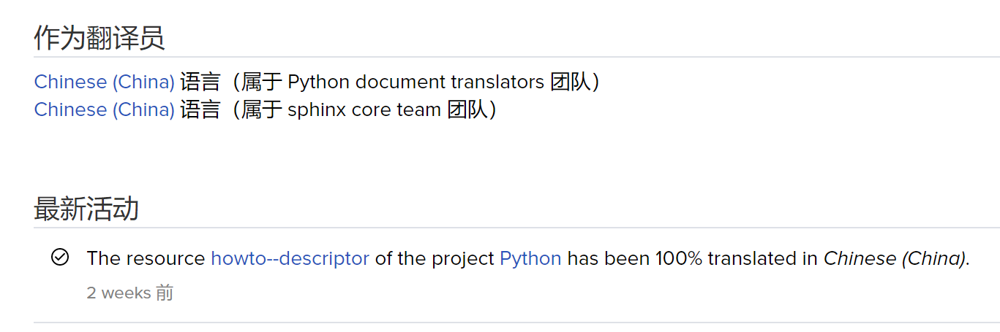

# 描述器学习指南

## 引言

Python 语言当前使用的解释器主要是 CPython，也就是说，基于面向过程的 C 语言构建了面向对象的 Python，那么其中的基础原理有哪些值得我们学习呢?


         **描述器**


我们来看看官方文档是怎么形容描述器的吧。

> **学习描述器能更深地理解 Python 工作的原理并更加体会到其设计的优雅性。  
> 描述器是一个强大而通用的协议。  
> 描述器是特征属性、方法静态方法、类方法和 `super()` 背后的实现机制。  
> 描述器在 Python 内部被广泛使用，实现了自 2.2 版本中（最早由** [**PEP252**](https://www.python.org/dev/peps/pep-0252/) **提出）引入的新式类。  
> 描述器简化了底层的 C 代码并为 Python 的日常程序提供了一组灵活的新工具。**

事实上描述器这个主题并不冷门，网上已有了大量的讨论。但是前几天在翻译官方文档间隙查资料的时候，发现已有的博文和参考资料大都比较零散，故在此作以简单整合。 


**本文的编排顺序是作者精心调整过的，建议您按照标题顺序依次阅读。**


作者秉持 **KISS** 主义，故而本文不对已有的博文做重复陈述，只给出对应链接。

**Keep it Simple, Stupid!**

## 0. 粗览官方文档

首先我们当然要 **浏览一下** 官方文档了，作者已经贡献了简中翻译。

[【官方文档】描述器使用指南 ](https://docs.python.org/zh-cn/3.9/howto/descriptor.html)



## 1. 了解Python属性访问顺序

首先，面向对象与面向过程的区别之一就是`cls.attribute`形式的调用，这被称为属性调用，这里的属性是指广义上的，**包括基础属性和方法**。  
那么我们就先来了解一下 Python 中的属性调用的顺序：

[python高级编程——描述符Descriptor详解（上篇）——python对象的属性访问优先级与属性的控制与访问）](https://blog.csdn.net/qq_27825451/article/details/84848341)  
[python高级编程——描述符Descriptor详解（中篇）——python对象的属性访问优先级与属性的控制与访问）](https://blog.csdn.net/qq_27825451/article/details/84767061)

### **对象属性访问顺序**

1. 依照 ****MRO 顺序的类的类属性中的 **数据描述器属性**
2. **实例对象的属性** `object.__dict__` 
3. 依照 MRO 顺序的类的类属性中的 **非数据描述器属性**
4. 依照 MRO 顺序的类的类属性中的 **普通（非描述器）属性** `cls.__dict__`

### **类属性访问顺序**

1. 依照元类的 MRO 顺序的类的类属性中的 **元类数据描述器属性**
2. 依照 MRO 顺序的类的类属性中的 **数据描述器属性**
3. 依照 MRO 顺序的类的类属性中的 **普通（非描述器）属性**`cls.__dict__`
4. 依照 MRO 顺序的类的类属性中的 **非数据描述器属性**
5. 依照元类的 MRO 顺序的类的类属性中的 **元类非数据描述器属性**


Python 中 **类的本质是元类创建的对象** ，所以相当于是外面套了一层不包含普通属性（亦即非描述器属性）的对象属性访问顺序。


## 2. 了解描述器协议

现在我们可以去看一下描述器的核心内容了。

 [python高级编程——描述符Descriptor详解（下篇）——python描述符三剑客详解](https://blog.csdn.net/qq_27825451/article/details/84848341)

### **描述器协议**

```python
descr.__get__(self, obj, type=None)

descr.__set__(self, obj, value)

descr.__delete__(self, obj)
```

定义这些方法中的任何一个的对象被视为描述器，在被作为属性时覆盖其默认行为。

> 仅当一个包含这些方法的类（称为 _描述器类_ ）的实例出现于一个 _所有者类_ 中的时候才会起作用（该描述器必须在所有者类或其某个上级类的字典中）。

如果一个对象定义了 `__set__()` 或 `__delete__()`，则它会被视为数据描述器。  
 仅定义了 `__get__()` 的描述器称为非数据描述器（它们通常被用于方法，但也可以有其他用途）。

数据和非数据描述器的不同之处在于，如何计算实例字典中条目的替代值。  
如果实例的字典具有与数据描述器同名的条目，则数据描述器优先。如果实例的字典具有与非数据描述器同名的条目，则该字典条目优先。

为了使数据描述器成为只读的，应该同时定义 `__get__()` 和 `__set__()` ，并在 `__set__()` 中引发 `AttributeError` 。用引发异常的占位符定义 `__set__()` 方法使其成为数据描述器。

## 3. 探究描述器核心原理

如果想要彻底地理解描述器，那么我们就不得不了解一下描述器的具体代码实现。  
但是直接上源码未必太过硬核，以流程图的形式去解析可能是最好的方式，下面这篇文章正是如此。

 [描述器\(1\)](https://www.dazhuanlan.com/2020/02/29/5e5965cea4d60/)

## 4. 实例练习

学习了这么多原理，最后自然要来个有实际意义例子来练练手了。看看怎样利用描述器来实现装饰器 `property` 吧。

[property 装饰器的描述器实现](property.md)

## 5. 细究官方文档

最后我们就可以再回头看看官方文档了，相信这次你可以轻松理解其中内容。

[【官方文档】描述器使用指南](https://docs.python.org/zh-cn/3.9/howto/descriptor.html)

## 参考源

1. [【官方文档】描述器使用指南](https://docs.python.org/zh-cn/3.9/howto/descriptor.html)
2. [python高级编程——描述符Descriptor详解（上篇）——python对象的属性访问优先级与属性的控制与访问）](https://blog.csdn.net/qq_27825451/article/details/84848341)
3. [python高级编程——描述符Descriptor详解（中篇）——python对象的属性访问优先级与属性的控制与访问）](https://blog.csdn.net/qq_27825451/article/details/84767061)
4. [python高级编程——描述符Descriptor详解（下篇）——python描述符三剑客详解](https://blog.csdn.net/qq_27825451/article/details/84848341)
5. [python高级编程——描述符Descriptor详解（补充篇）——python描述符实现一些底层高级功能](https://blog.csdn.net/qq_27825451/article/details/84848341)
6. [描述器\(1\)](https://www.dazhuanlan.com/2020/02/29/5e5965cea4d60/)
7. [Python中的类与描述器\(Descriptors\)](https://blog.csdn.net/u013008795/article/details/90646667)
8. [property 装饰器的描述器实现](https://blog.csdn.net/WH2099/article/details/105328929)

